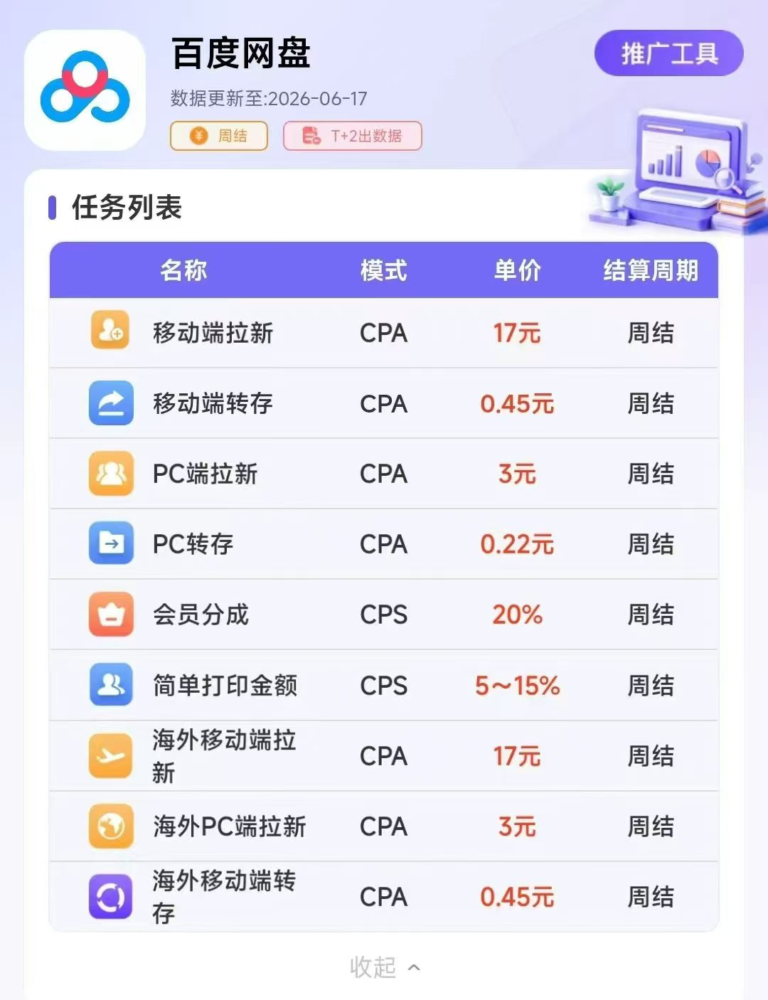
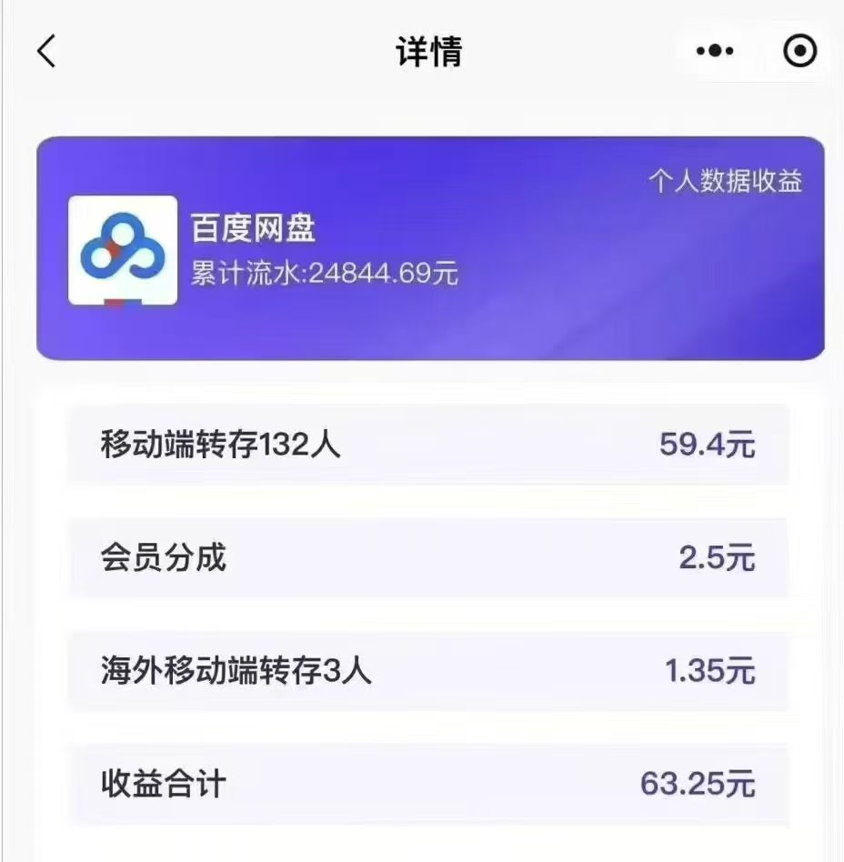
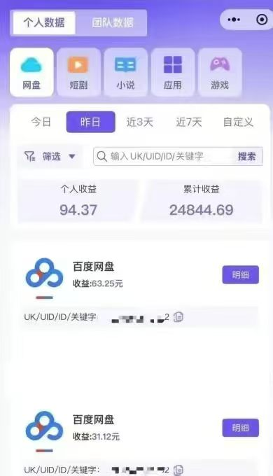
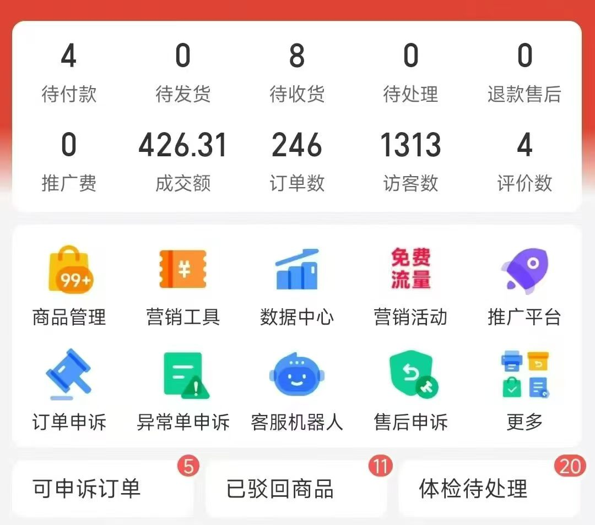

# programmerSideline
程序员副业赚钱之路

虚拟资料开店和网盘转存推广，每天花2小时，多开几个闲鱼淘宝多多虚拟店铺，每个店铺日入几十到几百都有。

虚拟资料开店，先从闲鱼淘宝入手，后期做的好，拼多多也可以开店，一个人可以开三个闲鱼店铺和淘宝店铺，每天看看同行的商家店铺的商品，看看哪个销量高的，直接搬过来自己上架，一天抽出1个半小时上架商品，每天坚持上架个十多个商品，不用半个月，店铺销量就会逐步增长

### 副业教程

链接: https://pan.baidu.com/s/1KgIauOQndSjmvdoGqC_UDQ?pwd=nrms

提取码: nrms

--来自百度网盘超级会员v4的分享

### 网盘转存教程

链接: https://pan.baidu.com/s/1tcUP223STqXaAAdnL7GIkg?pwd=c5hf

提取码: c5hf

--来自百度网盘超级会员v4的分享

### 【腾讯文档】资料汇总分享
https://docs.qq.com/sheet/DTGhyVWRYRFRPRFpO?tab=g4ujf7

## 一、副业网盘转存推广收益

销售虚拟资料的同时，也可以做网盘转存推广，虚拟资料用网盘分享，客户转存你的网盘链接，你就能获益，如果客户开通，也能获得分成

## 二、虚拟资料开店教程

